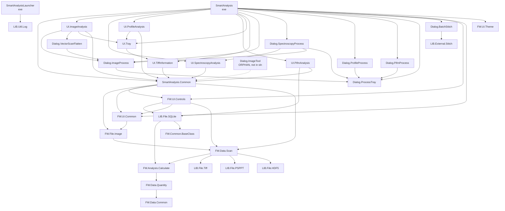

# SmartAnalysis — Structure, Dependencies & Execution Flow

Scope: Solution/project structure, dependency graph, build/entry points, end-to-end execution flow.
Repo: `C:/Users/HyuckJin.Kwon/SmartAnalysis-Private/SmartAnalysis-Private` (read-only analysis).
All projects target **`net8.0-windows`** (WPF, `UseWPF=true` except pure libs). Solution: `SmartAnalysis.sln`.

---

## 1. Project Inventory

47 `.csproj` files. Grouped by layer. Type legend: **exe** = WinExe/Exe, **lib** = class library, **test** = xUnit-style test exe, **bench** = BenchmarkDotNet exe.

### Framework/ (reusable engine — `FW.*`)
| Project | Type | Responsibility |
|---|---|---|
| `Framework/Common/FW.Common` | lib | Base constants/utilities, `CommonConst` (app name, mutex id, paths), WPF-level common. Leaf. |
| `Framework/Common/FW.Common.BaseClass` | lib | MVVM base classes: `BaseViewModel`, document-window framework (`AbstractChildWindow`, `DocumentWindowViewModel`, `SingletonDocumentWindow`), commands, messaging tokens, tray-item base. → FW.Common |
| `Framework/Data/FW.Data.Common` | lib | Data enums/common types (`EScanImageDataType`, etc.). Leaf. |
| `Framework/Data/FW.Data.Quantity` | lib | Physical units/quantities (`Length`, `UnitHelper`, `RawToRealTransform`). → FW.Data.Common |
| `Framework/Data/FW.Data.Scan` | lib | **Core scan data model**: `BaseScanData`, `ImageBaseScanData`, `PinPointScanData`, `PifmScanData`, `Raw↔Real` managers. → LIB.File.HDF5/PSPPT/Tiff, FW.Analysis.Calculate, FW.Common(.BaseClass), FW.Data.Common/Quantity |
| `Framework/Analysis/FW.Analysis.Calculate` | lib | Numerical algorithms (flatten/filter/FFT math etc.). → LIB.Util.Log, FW.Data.Common/Quantity |
| `Framework/File/FW.File.Image` | lib | TIFF/image IO orchestration: `TiffReader`, `TiffWriter`, `TiffImportHelper`. → LIB.File.PSPPT/Tiff, LIB.Util.Common, FW.Common.BaseClass, FW.Data.Scan |
| `Framework/File/FW.File.HDF5` | lib | HDF5→scan wrapper. → FW.Data.Scan. **Likely orphan** (no project references it; the runtime uses `LIB.File.HDF5` instead — UNVERIFIED whether loaded via reflection). |
| `Framework/Helper/FW.Helper.Log` | lib | `Log4net` init helper. → LIB.Util.Log |
| `Framework/UI/FW.UI.Common` | lib | Shared WPF styles/resources, helpers, loading bars. → FW.Analysis.Calculate, FW.Common.BaseClass, FW.Data.Quantity/Scan, FW.File.Image |
| `Framework/UI/FW.UI.Controls` | lib | **Reusable WPF controls**: InteractiveImage (2D), Image3D export, dialogs, charts. → LIB.File.SQLite, FW.Analysis.Calculate, FW.Common.BaseClass, FW.Data.Scan, FW.UI.Common, FW.UI.MessageBox |
| `Framework/UI/FW.UI.MessageBox` | lib | Themed message boxes (`ExMessageBox`, `DxMessageBoxEx`). Leaf. |
| `Framework/UI/FW.UI.Theme` | lib | Theme resources/logo. Leaf. |
| `Framework/Analysis/FW.Analysis.Calculate.Test` | bench/test | Tests for calculate. |
| `Framework/Analysis/FW.Analysis.Calculate.Benchmark` | bench | BenchmarkDotNet for calculate. |
| `Framework/Data/FW.Data.Quantity.Test` | test (Exe) | Tests for quantity. |
| `Framework/Data/FW.Data.Scan.Benchmark` | bench (Exe) | BenchmarkDotNet for scan. |
| `Framework/UI/FW.UI.Controls.Test` | test (Exe) | Tests for controls. |

### Library/ (thin external/IO wrappers — `LIB.*`)
| Project | Type | Responsibility |
|---|---|---|
| `Library/Util/LIB.Util.Common` | lib | Enum description helpers (`EnumDescription`), misc. Leaf. |
| `Library/Util/LIB.Util.Log` | lib | Logging facade: `Logger`, `Log`, `Log4net`, plus `PspptPerformanceLogging`, `RuntimePerformanceMeasurement`, memory measurement. Leaf. |
| `Library/File/LIB.File.Tiff` | lib | Low-level TIFF read/write; `EOpenFileType`, `EScanImageType` enums live here. → LIB.Util.Common/Log |
| `Library/File/LIB.File.PSPPT` | lib | PS-PPT (Fast PinPoint curve) file reader `PspptFile`. → LIB.Util.Log |
| `Library/File/LIB.File.HDF5` | lib | HDF5 reader `Hdf5File` (PiFM). → LIB.Util.Log |
| `Library/File/LIB.File.SQLite` | lib | SQLite spectrum-library storage (`SpectrumLibraryManager`). ⚠ **→ FW.Analysis.Calculate, FW.Common(.BaseClass)** (Library references Framework — inverted layering). |
| `Library/External/LIB.External.Stitch` | lib | Image stitching algorithm (external). Leaf. |
| `Library/External/LIB.External.Stitch.Test` | test (Exe) | Stitch tests. |
| `Library/File/LIB.File.SQLite.Test` | test (Exe) | SQLite tests. |

### Project/SmartAnalysis/ (the application)
| Project | Type | Responsibility |
|---|---|---|
| `Project/.../SmartAnalysisLauncher` | **exe (WinExe)** | Tiny bootstrap launcher: single-instance mutex + named-pipe forwarding, then `Process.Start("SmartAnalysis.exe")`. → LIB.Util.Log |
| `Project/.../SmartAnalysis` | **exe (WinExe)** | **Main WPF app** (`App`, `MainWindowView`, desk ViewModels, ribbon/backstage). AssemblyVersion 2.2.7. References all UIPages + Dialogs + framework. |
| `Project/.../Common/SmartAnalysis.Common` | lib | App-shared models: tray-item models (`ImageTrayItemModel`, `PifmTrayItemModel`, `SpectroscopyTrayItemModel`, `ProfileTrayItemModel`), `ProcessResultTimingContext`, helpers, enums. → FW.Common.BaseClass, FW.Data.Quantity/Scan, FW.File.Image, FW.UI.Common/Controls |
| `Project/.../UIPages/SmartAnalysis.UI.ImageAnalysis` | lib | Image analysis page (2D/3D/multi/overview, line profile, histogram, PSD, grain). → ImageProcess+VectorScanFlatten dialogs, UI.Tray, many FW |
| `Project/.../UIPages/SmartAnalysis.UI.SpectroscopyAnalysis` | lib | Spectroscopy (force-distance etc.) analysis page. |
| `Project/.../UIPages/SmartAnalysis.UI.ProfileAnalysis` | lib | Line-profile analysis page. → UI.Tray |
| `Project/.../UIPages/SmartAnalysis.UI.PifmAnalysis` | lib | PiFM analysis page: workspaces, spectrum navigator, spectrum library. → LIB.File.SQLite |
| `Project/.../UIPages/SmartAnalysis.UI.TiffInformation` | lib | TIFF metadata info panel. |
| `Project/.../UIPages/SmartAnalysis.UI.Tray` | lib | Left "tray" list of opened items (`TrayViewModel`). → UI.TiffInformation |
| `Project/.../Dialogs/SmartAnalysis.Dialog.ImageProcess` | lib | Image processing dialogs (flatten, filter, FFT, crop, arithmetic, stitch, deglitch, rotate/flip, pixel manip, EZ flatten, adaptive ML flatten). → ProcessTray |
| `Project/.../Dialogs/SmartAnalysis.Dialog.SpectroscopyProcess` | lib | Spectroscopy processing dialogs. → UI.SpectroscopyAnalysis, ImageProcess, ProcessTray |
| `Project/.../Dialogs/SmartAnalysis.Dialog.ProfileProcess` | lib | Profile processing dialogs (flatten/crop/filter). → ProcessTray |
| `Project/.../Dialogs/SmartAnalysis.Dialog.PifmProcess` | lib | PiFM processing dialogs (baseline correction etc.). → ProcessTray |
| `Project/.../Dialogs/SmartAnalysis.Dialog.ProcessTray` | lib | Shared "process preview tray" host used by all process dialogs. |
| `Project/.../Dialogs/SmartAnalysis.Dialog.VectorScanFlatten` | lib | Vector-scan flatten dialog. → ImageProcess |
| `Project/.../Dialogs/SmartAnalysis.Dialog.BatchStitch` | lib | Batch stitching tool. → LIB.External.Stitch |
| `Project/.../Dialogs/SmartAnalysis.Dialog.ImageTool` | lib | ⚠ **ORPHAN**: on disk, references SmartAnalysis.Common, but **not in `SmartAnalysis.sln`** and referenced by no other project. |
| `*.Test` (ImageProcess/ProfileProcess/PifmAnalysis/ProfileAnalysis) | test (Exe) | Per-module test exes. |

Executable/entry projects: **`SmartAnalysisLauncher`** (installed entry) and **`SmartAnalysis`** (actual app). All test/benchmark projects are `OutputType=Exe`. Everything else is a library.

---

## 2. Dependency Graph

Parsed from `ProjectReference` in every `.csproj`. Leaf framework refs pruned for readability; test/benchmark nodes omitted from the graph (each references only its subject project).



### Key graph observations
- **Entry/root nodes**: `SmartAnalysisLauncher` (starts the process) and `SmartAnalysis` (the WPF UI root). No DI container — object graph is hand-wired in constructors (see §3).
- **Common base libraries**: `FW.Common` / `FW.Common.BaseClass` (MVVM + doc-window base), `FW.Data.Common/Quantity/Scan` (data core), `SmartAnalysis.Common` (app models). `SmartAnalysis.Common` and `FW.UI.Controls` are the most widely referenced app/framework libs.
- ⚠ **Inverted (reverse) layering**: `LIB.File.SQLite` (a "Library") references **up** into Framework (`FW.Analysis.Calculate`, `FW.Common`, `FW.Common.BaseClass`). Then `FW.UI.Controls` references `LIB.File.SQLite`, so a build path goes `FW.UI.Controls → LIB.File.SQLite → FW.Analysis.Calculate`. No project-level cycle (SQLite never references UI.Controls), but the Library→Framework direction breaks the intended layering and couples the SQLite spectrum-library store to the calc/common framework.
- ⚠ **"Data" depends on "Analysis"**: `FW.Data.Scan → FW.Analysis.Calculate`. The data model layer pulls in the algorithm layer, so scan-data objects and analysis math cannot be separated.
- ⚠ **UI-page ↔ dialog tight coupling**: `SmartAnalysis.UI.SpectroscopyAnalysis` is referenced by `SmartAnalysis.Dialog.SpectroscopyProcess`, while both are referenced by the main exe; `SmartAnalysis.UI.ImageAnalysis → Dialog.ImageProcess`/`Dialog.VectorScanFlatten`. Analysis "view" projects and their "process dialog" projects are mutually entangled (no cycle, but no clean seam).
- **Orphans / dead projects**: `Project/.../Dialogs/SmartAnalysis.Dialog.ImageTool` (not in solution, referenced by nobody). `Framework/File/FW.File.HDF5` builds but no project references it (HDF5 is consumed through `LIB.File.HDF5`); flag as likely dead — UNVERIFIED it isn't loaded by reflection.
- No cyclic ProjectReference detected among in-solution projects.

---

## 3. Entry Point & Startup

### 3a. Launcher process (`SmartAnalysisLauncher/Launcher.cs`)
- `Launcher.Main(string[] args)` `Launcher.cs:8` — classic `static void Main`.
- Creates a **global single-instance mutex** `"Global\\SmartAnalysis 2.0"` `Launcher.cs:13,19`.
- If an instance already runs (`!canCreateNewMutex`): opens a **NamedPipeClientStream** named `"SmartAnalysis 2.0"` and writes each existing file path to the running app `Launcher.cs:22-52` (this is how double-clicking a file in Explorer forwards to the live app).
- Else: `Process.Start` of `SmartAnalysis.exe` in the same base dir, passing args `Launcher.cs:54-73`.
- Note: launcher's mutex id (`"Global\\" + "SmartAnalysis 2.0"`, `Launcher.cs:13`) is the **same** name as the app's `CommonConst.MUTEX_ID` (`= "Global\\" + APP_NAME_SMARTANALYSIS`, `FW.Common/CommonConst.cs:16`). The launcher only holds it transiently (released when the short-lived launcher process exits after `Process.Start`); the running app then owns it, so the launcher's `!canCreateNewMutex` check correctly detects a live app and forwards via pipe. Errors are appended to `Launcher.log`. Constants: `COMPANY_NAME="Park Systems Corp."`, `APP_NAME_SMARTANALYSIS="SmartAnalysis 2.0"`, pipe/app name `"SmartAnalysis 2.0"`, config/docs under `Documents\ParkSystems\SmartAnalysis 2.0\` (`CommonConst.cs:8-23`).

### 3b. Main WPF app (`SmartAnalysis/App.xaml` + `App.xaml.cs`)
`App.xaml` has **no `StartupUri`** — startup is fully code-driven in `App.OnStartup`. `App.xaml:22-29` registers a DevExpress `NotificationService` (Win8 toast) resource and merges `FW.UI.Common` style dictionaries `App.xaml:12-15`.

`App.OnStartup(StartupEventArgs e)` `App.xaml.cs:155` sequence:
1. **Profile optimization**: creates `%LocalAppData%\Parksystems\SmartAnalysis 2.0`, `ProfileOptimization.SetProfileRoot/StartProfile("Startup.Profile")` `App.xaml.cs:157-160`.
2. **Single-instance mutex** `CommonConst.MUTEX_ID` `App.xaml.cs:166`. If another instance holds it and the arg is a `.tiff`/`.ps-ppt`, it calls `SendToExistingInstance` (pipe client) and `Environment.Exit(0)` `App.xaml.cs:169-177`.
3. **Logging init**: `Log4net.InitializeLog4net(CommonConst.LOG4NET_CONFIG_FILENAME, appName, ...)` `App.xaml.cs:179`; logs banner.
4. `base.OnStartup(e)` then **`InitEnvironmentMain()`** `App.xaml.cs:185-186`.
5. **`ShowSplashScreen(appVersion)`** — DevExpress `DXSplashScreenViewModel` fluent splash with logo from `FW.UI.Theme` `App.xaml.cs:39-53,187`.
6. **`StartPipeServer()`** — creates async `NamedPipeServerStream("SmartAnalysis 2.0", In, Message)`; on message, marshals to UI thread via `Current.Dispatcher.Invoke` and calls `main.ViewModel.Menu.OpenFileWithSplashScreen([message])` `App.xaml.cs:68-125,188`. Recreates itself per connection.
7. **Creates `MainWindowView main = new()`** `App.xaml.cs:190`; sets `main.ViewModel.FilePathFromExploreOpen = str` (the CLI file arg), wires `DxMessageBoxEx`/`ExMessageBox` owners, `main.Show()` `App.xaml.cs:190-201`.

`App.InitEnvironmentMain()` `App.xaml.cs:225`:
- Registers **three unhandled-exception handlers** (`Dispatcher.UnhandledException`, `AppDomain.CurrentDomain.UnhandledException`, `Current.DispatcherUnhandledException`) — all write a dump file to `MyDocuments\Parksystems\...\UnhandledException\` and `Environment.Exit(0)` `App.xaml.cs:227-229,256-299`.
- **Theme init**: `ThemeManager.EnableDefaultThemeLoading = true`; theme from `Settings.Default.ApplicationThemeName` (default `Theme.Win11DarkName`); `ApplicationThemeHelper.Preload(Ribbon, Docking, LayoutControl, Grid)` `App.xaml.cs:231-240`.
- **SciChart license**: `SciChartSurface.SetRuntimeLicenseKey(...)` hard-coded `App.xaml.cs:243`.
- **DevExpress license**: implicit via NuGet `DevExpress.Wpf 26.1.3` packages (no explicit runtime key call seen).

`App.OnExit` `App.xaml.cs:214` stops the pipe server and disposes the mutex.

### 3c. Shell composition (`MainWindowView` + `MainWindowViewModel`)
- `MainWindowView` is a DevExpress `ThemedWindow` `MainWindowView.xaml.cs:32`. Ctor `:47` calls `InitializeComponent()`, `tiffInfoView.ViewModel.CreateEventHandler()`, then **`ViewModel = new MainWindowViewModel(this)`** `:51`, wires mouse/size/loaded/closing handlers and a `Messenger` registration for a global busy overlay.
- `MainWindowViewModel(MainWindowView parent)` `MainWindowViewModel.cs:134` hand-wires the whole app object graph (no IoC):
  - `TrayVM = new TrayViewModel(parent.ControlTrayView)` `:139`
  - `InitWorkspace()` → 2 `PifmWorkspaceItemViewModel` `:141,204-207`
  - `ImagemultiVM`, `SpectrumNavigatorVM(Workspaces)` `:143-144`
  - `Document = new DocumentWindowViewModel(ParentView.dockLayoutManager)` `:147` (DevExpress docking host)
  - **`Menu = new MainMenuCommandViewModel(this)`** `:148` — the file-open/command orchestrator
  - `ConfigurationManager`, `BackstageHomeVM`, `BackstageSettingsVM` `:149-151`
  - `_ = UnitHelper.AllUnits;` forces unit table init `:153`
  - `_dialogService.RegisterDialog<...>()` ×5 (DevExpress-style dialog registration for the spectrum library) `:155-159`
  - Builds all `RelayCommand`s (ImageProcess/Spectroscopy/Profile/Pifm/Export/BatchStitch) `:161-170`
  - `CreateEventHandler()` `:172` registers `Messenger.Default` tokens (`OnTrayOpenedItemChanged`, `OnTrayItemDeleted`, `OnSaveAsTrayItem`) and docking events.
- **Global singletons / static state observed**: `Messenger.Default` (DevExpress MVVM global message bus, used pervasively), `AuthorityManager.Instance` (`MainMenuCommandViewModel.cs:848`), `OptionalItemManager` (static, `MainWindowViewModel.cs:396`), `ProcessResultTimingContext.Current` (ambient timing context, `MainWindowViewModel.cs:235`), `ScreenSize` static (`MainWindowView.xaml.cs:68-77`), static named-pipe fields on `App`. No dependency-injection container anywhere.
- **First-shown UI**: `MainWindowView.DXRibbonWindow_Loaded` `:128` opens the **Backstage** (ribbon file menu) on startup; if launched with a file arg it closes backstage; then `ScheduleOverviewWarmup()` `:140` builds a hidden dummy `ImageAnalysisView` to pre-JIT the image pipeline `:246-352`.
- **Config load** on `MainWindowViewModel.OnParent_Loaded` `:584`: `ConfigurationManager.LoadLayout` (DevExpress `RestoreLayoutFromXml`), `BackstageHomeVM.Load()`, `BackstageSettingsVM.LoadSettings()`, then if a file arg is present → `Menu.OpenFileWithSplashScreen([FilePathFromExploreOpen])` `:586-593`. Config files live under `Documents\...\Config\`: `layout.xml`, `settings.xml`, `optionals.xml`, `recentFiles.xml` (`ConfigurationManager.cs:29-32`).

---

## 4. End-to-End Execution Flow

### 4.0 Format detection (all types)
`OpenFileTypeExtensions.FromOpenFileType(fileName)` `LIB.File.Tiff/Enum/EOpenFileType.cs:45` → takes the file extension, upper-cases, matches against `[Description]` of `EOpenFileType` (`TIFF`, `PS-PPT`, `H5`) → returns `EOpenFileType { None, Tiff, PS_PPT, HDF5 }` `EOpenFileType.cs:8-21`. Extension-based only (no magic-byte sniffing at this layer).

The **data-type branch** that drives which analysis view/model is built is NOT the file type but `scanData.Header.ImageType` (`EScanImageType { Scan2DMappedImage, LineProfileImage, SpectroscopyImage }`, `LIB.File.Tiff/Enum/EScanImageType.cs`) combined with the `scanData.IsPiFM` flag. So:

| Header.ImageType | IsPiFM | Analysis view | Tray model |
|---|---|---|---|
| `Scan2DMappedImage` | — | `ImageAnalysisView` | `ImageTrayItemModel` |
| `SpectroscopyImage` | false | `SpectroscopyAnalysisView` | `SpectroscopyTrayItemModel` |
| `SpectroscopyImage` | true | `PifmAnalysisView` | `PifmTrayItemModel` |
| `LineProfileImage` | — | `ProfileAnalysisView` | `ProfileTrayItemModel` |
(branch defined in `MainMenuCommandViewModel.CreateAnalysisWindow` `:569-595` and `AddToTrayAndRecentFiles` `:599-649`.)

### 4.1 File open orchestration (`MainMenuCommandViewModel`)
Entry points (all funnel to one async pipeline):
- Ribbon "Open" → `OpenFilesFromDialog` `:850` (uses `FileExplorerHelper.ShowOpenDialogAndGetPaths`).
- Explorer double-click / second instance → pipe → `OpenFileWithSplashScreen` `:789` (public) or via `Messenger` token `OnOpenTiffFile` → `OpenFilesWithSplashScreen` `:101`.
- Startup file arg → `MainWindowViewModel.OnParent_Loaded` → `Menu.OpenFileWithSplashScreen`.

Pipeline:
1. `OpenFilesWithSplashScreenAsync(filePaths)` `:106` — guarded by a **`SemaphoreSlim _fileOpenSemaphore(1,1)`** `:37,111` (serializes concurrent opens). Chooses wait-indicator (single file) vs progress splash (multi) `:114-115`.
2. `ProcessFileOpenSequenceAsync` `:164` iterates files:
   - missing file → `HandleFileMissing` `:176`;
   - already-open file → `AskReopenFile` → `ReopenFileAsync` `:184-190`;
   - multi-file TIFF non-last → **deferred metadata-only open** (`useDeferredActivation`) `:192-198` (lazy: only metadata parsed, full open deferred until the tray item is selected → `OpenDeferredTrayItem`/`OpenDeferredTrayItem` `:794`).
3. `TryOpenFileAsync` `:339` wraps `OpenFileAsync` in try/catch, logging + `WinUIMessageBox` on failure (splash hidden/restored around the dialog).

### 4.2 Parse → data-model creation (`OpenFileAsync` `:446`)
Branch on `OpenFileType` `:456-500`:
- **TIFF** → `TiffReader.ReadMetadataOnlyOfTiff(path)` (deferred) or `TiffReader.ReadBaseScanDataOfTiff(path)` `:459-461` (in `FW.File.Image`). Produces a `BaseScanData` subtype whose `Header.ImageType`/`IsPiFM` are set during parse.
- **PS-PPT (Fast PinPoint curves)** → on a **background `Task.Run`** `:477`: `new PspptFile(path, useRtfdStreaming)` (RTFD streaming when file ≥ 1 GB `:35,466`), wrapped by `new PinPointScanData(psppt)`, `pptScanData.Initialize()` with `ProgressChanged += OnProgressChanged` `:477-492`. Emits `DXSplashScreen.Progress` via `OnProgressChanged` `:548-567` (marshalled to Dispatcher).
- **HDF5 (PiFM)** → `new Hdf5File(path)`, `ThrowIfInvalid()`, `new PifmScanData(h5File)` `:495-499`.

**Subtype selection during TIFF parse** — `TiffReader.ReadBaseScanDataOfTiff` (`FW.File.Image/Tiff/TiffReader.cs:19-41`) switches on `(EScanImageType)tiff.TiffMeta.Header.ImageType`: `SpectroscopyImage`+`SpectType==PIFM_SPECTROSCOPY` → `PifmScanData(tiff)` else `SpectroscopyScanData(tiff)` (`:24-33`); `LineProfileImage` → `LineProfileScanData` (`:35`); default (`Scan2DMappedImage`) → `ImageScanData` (`:38`). `ReadMetadataOnlyOfTiff` (`:43-58`) uses `ETiffLoadMode.MetadataOnly` and falls back to full read for spectroscopy.

**`Header.ImageType`** is not computed — it is read straight from the parsed TIFF/PSIA header field and cast (`TiffReader.cs:22,46`). **`IsPiFM`** is decided in `BaseScanData.GetIsPiFM(TiffFile)` (`FW.Data.Scan/BaseScanData.cs:82-100`): true when header is `PsiaHeaderStruct` AND `SpectroscopyMeta.Header.SpectType == 11`, or when `ExtendHeader.UsePifmInfo`; `PifmScanData` ctors force it true. The spectroscopy sub-type comes from `SpectType` int mapped in `SpectroscopyScanData.SetSpectroscopyDataType` (`SpectroscopyScanData.cs:192-321`), `11 → PIFM_SPECTROSCOPY`.

**`PinPointScanData.Initialize()`** (`FW.Data.Scan/PinPointScanData.cs:52-147`): parses ScanStart/ScanStop/Param JSON, parses RTFD point frames (streaming vs parallel per `UseRtfdStreaming`) into `SpectroscopyPointData[]`, sets `OpenFileType`, then synthesizes headers — `MakePinPointToScanHeader()` sets `ImageType = SpectroscopyImage` (`:282`). **"Fast PinPoint"** = the SmartScan-driven PS-PPT variant: when `PPTParam.Fastpinpoint?.SmartScan != null` the header is filled from `Fastpinpoint.SmartScan` (`:288-307`), else `ImageMode="PS-PPT"` (models `PPTParamFastPinPointModel`/`FastPinPointSmartScanModel`/`FastPinPointDaqModel`).

**Scan-data class hierarchy** (all in `Framework/Data/FW.Data.Scan/`):
```
BaseScanData (abstract; OpenFileType, Header/HeaderStruct, Palette, Manager2D/3D, IsPiFM)  BaseScanData.cs:14
└─ ImageBaseScanData (Data buffer, PhysicalZDataCollection, HeadModes)                     ImageBaseScanData.cs:13
   ├─ ImageScanData             (Scan2DMappedImage)                                        ImageScanData.cs:5
   ├─ LineProfileScanData       (LineProfileImage)                                         LineProfileScanData.cs:5
   └─ SpectroscopyScanData      (SpectroscopyHeader, SpectroscopyPoints, PointDatas)       SpectroscopyScanData.cs:8
      ├─ PinPointScanData       (PS-PPT / Fast PinPoint; ProgressChanged, Initialize)      PinPointScanData.cs:23
      └─ PifmScanData           (HDF5 or PIFM-TIFF; forces IsPiFM)                          PifmScanData.cs:12
```
`Manager2D`/`Manager3D` (raw↔real unit transforms) are built in `BaseScanData.SetManager()` (`:102-129`) from header scan sizes / gain / unit.

**HDF5/PiFM parse** — `Hdf5File` ctor (`LIB.File.HDF5/Hdf5File.cs:30-76`) opens (unicode-safe path handling), runs `Hdf5StrictValidator`, loads image/point/thumbnail into `Hdf5Raw`; `ThrowIfInvalid()` (`:642`) throws on failure. `PifmScanData(Hdf5File)` (`PifmScanData.cs:30-58`) sets `IsPiFM=true`, `IsDetectionFrequency`, `SpectroScopyDataType=PIFM_SPECTROSCOPY`, then `MapHeaders`/`LoadReferenceImage`/`LoadSpectroscopyPoints`/`UpdatePhysicalZData`.

### 4.3 Analysis-window creation & tray registration
- `CreateAnalysisWindow(scanData)` `:569` — switch on `Header.ImageType`(+`IsPiFM`) → constructs `ImageAnalysisView` / `PifmAnalysisView` / `SpectroscopyAnalysisView` / `ProfileAnalysisView`; unsupported → warning box `:589-593`.
- `AddToTrayAndRecentFiles` `:599` — builds the matching `*TrayItemModel`, sets `IsFromFile`, `IsDeferredFullOpenPending`, `MainViewModel.AddTrayItemToTray(trayItem, OverwriteSaveAsIndex)` `:639`, adds to recent files, updates TIFF info panel, then (unless deferred) `InitializeAnalysisWindow` `:645-648`.
- `InitializeAnalysisWindow` `:651` — per type calls the page VM initializer:
  - Image: `view.ViewModel.InitAnalysisTrayItem((ImageTrayItemModel)trayItem, ImagemultiVM, GetOrCreateVectorScanAnalysisView)` then `InitAnalysisImageModel()` `:661-662`.
  - Spectroscopy: `specView.ViewModel.InitAnalysisWindow((SpectroscopyTrayItemModel)trayItem)` `:669`.
  - PiFM: `pifmView.ViewModel.InitAnalysisWindow(trayItem, _dialogService, _libraryManager, Workspaces)` `:673`.
  - Profile: `profileView.ViewModel.InitAnalysisWindow((ProfileTrayItemModel)trayItem)` `:680`.

### 4.3b Visualization / view composition (per page)
**Rendering libraries (definitive):** 2D scan images render as a plain WPF `<Image>` bound to a `WriteableBitmap` with an MShape vector overlay (`FW.UI.Controls/InteractiveImage/InteractiveImageView.xaml:315-327`), **not** a chart control. All XY curve charts use **SciChart 2D** (`SciChartSurface`); the 3D surface uses **SciChart3D** (`SciChart3DSurface` + `SurfaceMeshRenderableSeries3D`). SciChart 9.0.0 is referenced in `FW.UI.Controls.csproj:31-32` (license set at `App.xaml.cs:243`). **DevExpress** provides only the shell: docking (`DockLayoutManager`), ribbon, tabs, grids, layout — no DevExpress plotting anywhere in `FW.UI.Controls`.

- **Image page** (`SmartAnalysis.UI.ImageAnalysis`): `ImageAnalysisViewModel` is a tab host; `EImageAnalysisTabType { ImageOverview, ImageLine, ImageRegion, Image3D, Grain, PSD, Multi, Overlay, VectorScan }` (`FW.Data.Common/Enum/EImageAnalysisTabType.cs:5-25`). `InitAnalysisTrayItem` `:150-179` pushes tray item+scan data into sub-VMs; `InitAnalysisImageModel` `:181-213` builds `ImageOverviewModel` and wires palette-bar events + background image-data prep; tabs are lazily built on `SelectionChanged` (`OnSelectionChangedImageAnalysisTab:590-675`). Overview = `InteractiveImageView` + histogram; **3D** = `Image3DViewModel` (`GetImage3DViewModel():285`) holding `SurfaceVM` (SciChart3D surface, `SurfaceImageView.xaml:712,768`), `LineProfileChartVM`, `LineHistogramVM`; **Multi** uses the single shared `ImageMultiViewModel`.
- **Spectroscopy page**: `SpectroscopyAnalysisViewModel.InitAnalysisWindow:84-116` chooses visible tabs by data type (Segmentation for PS-PPT, FD+Modulus for FD_SPECTROSCOPY, Modulus for NANO_INDENTATION); tabs lazily built; curves on SciChart (`SpectroscopyLineChartView.xaml:121`), 2D map via `SpectroscopyImageViewModel`.
- **PiFM page**: `PifmAnalysisViewModel.InitAnalysisWindow:56-86` builds Explore (always) + Spectra/Identification (only if interest channels present) + `PifmWorkspaceView(workspaces)`. Spectra render on SciChart (`PiFMMultiChartView.xaml:268`). `SpectrumNavigatorViewModel` holds the shared `Workspaces` and listens on `Messenger` token `OnAddSpectrumToNavigator`; spectrum library is SQLite-backed via `SpectrumLibraryManager` (`LIB.File.SQLite`).
- **Profile page**: `ProfileAnalysisViewModel.InitAnalysisWindow:77-88` validates then builds `ProfileLineView` (eager) + `ProfileMultiView` (lazy); curves on SciChart (`ProfileLineChart.xaml:267`).
- **Tray**: `TrayViewModel.AllItems` (`ObservableCollection<TrayItemViewModel>`) filtered into `FilteredItems` by `ETrayTiffType`; `ParentId`-based tree (`GetDescendants`); `OpenedTiffItem` drives the active document. `BaseTrayItemModel` (`SmartAnalysis.Common/Model/BaseTrayItemModel.cs`) is the link between a tray entry and its open `AnalysisWindow` (`AbstractChildWindow`), with typed subclasses Image/Spectroscopy/Pifm/Profile.
- **Document-window framework** (`FW.Common.BaseClass`): `AbstractChildWindow` = a `UserControl` (base of every analysis view); `SingletonDocumentWindow : AbstractDocumentWindow` wraps one child as a DevExpress `DocumentPanel`; `DocumentWindowViewModel` manages the `DockLayoutManager` + `DocumentGroup` (`MDIStyle.Tabbed`), add/remove/activate, and raises activate/remove events.

### 4.4 Tray selection → document window (navigator/shell)
- Selecting a tray item raises `Messenger` `OnTrayOpenedItemChanged` → `MainWindowViewModel.OnTrayItemSelectionChanged` `:446`. If the item is a deferred stub → `Menu.OpenDeferredTrayItem` (full parse now). Else `CreateSingletonDocumentWindow(trayItem.AnalysisWindow, timing)` `:460` docks the analysis view as a DevExpress `DocumentPanel` (dedup via `FindDocumentWindow`, hides previously-visible doc) `:238-312`, and updates the TIFF info panel `:462-464`. VectorScan view is re-attached to `ImageAnalysisView` if present `:472-475`.

### 4.5 Analysis selection → parameter input → algorithm → result → linking
(Ribbon process buttons live on `MainWindowViewModel`.)
- `OnImageProcessCommandMethod(param=EImageProcessType)` `:627` — requires an open `Scan2DMappedImage` tray item; `EnsureImageDataForProcess` lazily materializes pixel data `:634,662-686`; opens **`ImageProcessView(processType, imageTrayItemModel)`** modal dialog `:638-644`; on close disposes and records timing.
- `OnSpectroscopyProcessCommandMethod` `:688` / `OnProfileProcessCommandMethod` `:718` / `OnPifmProcessCommandMethod` `:739` — same pattern with per-type guards (`CanExecuteSpectroscopyProcess` `:185-202`, `IsDetectionFrequency`/`IsPifm` checks).
**Dialog internals (Image process, representative)** — `ImageProcessView(EImageProcessType, ImageTrayItemModel)` (`SmartAnalysis.Dialog.ImageProcess/View/ImageProcessView.xaml.cs:23`) sets tab = `(int)ProcessType` and creates `ImageProcessViewModel`. The container VM (`ViewModel/ImageProcessViewModel.cs:82`) is a **shell**: it clones the source item into an in-dialog `ProcessTray` (`Initialize:94`), and `CreateProcessWindow` `:137` switches the `EImageProcessType` enum to a concrete child view/VM tab (lazily on selection `:479`). **The algorithm runs in the child VM, not the container.**
- Example: `ImageProcessFlattenViewModel.ExecutePreviewFlatten` `:1020` → `ExecuteLineFlatten` `:1278` disables the dialog (`IsViewEnabled=false`), shows a `SplashScreenManager` wait indicator, and runs the regression **off the UI thread**: `await Task.Run(() => executor.ComputeFlattenRawZValues(...))` `:1316`, then rebuilds `ImageBaseScanData` on the UI thread (`BuildFlattenedModel`). Most child VMs follow this `Task.Run` + splash pattern (Filter `:787`, Fourier `:225,394`, RotateFlip, arithmetic, crop, stitch).
- **`EImageProcessType`** (`SmartAnalysis.Common/Enum/EImageProcessType.cs:5`): `Crop=0, Filter, Flatten, Deglitch, FourierFilter, TipEstimation, RotateFlip, PixelManipulation, UnaryArithmetic, BinaryArithmetic, Stitch, EzFlatten` (ordinal == tab index).
- **Progress**: no percentage bar — modal `SplashScreenManager` "Processing…" indicator. **Cancellation**: two paths — (1) `ICancelableProcess` (`ImageProcessEzFlattenViewModel`) driven by ESC in the container (`OnPreviewKeyDown → TryCancelActiveProcess`); (2) `CancellationTokenSource` in `ImageProcessFourierFilterViewModel` (`_executeFilterCts`), plus `IsBusyForClose` polled by the container to block tab-switch/close while a kernel runs.

**Where the math lives** — numeric kernels are in `FW.Analysis.Calculate/`: `PolynomialLeastSquaresRegression` (`.Fit/.Infer`, used by `LineFlattenProcess`/`WholeFlattenProcess`), `MultiplePolynomialRegression` (`SurfaceFlattenProcess`), `Filter/ConvolutionFilter`/`SmoothingFilter`/`SavitzkyGolayFilter`, `Filter/Image2DFourierFilter` (`FourierFilterProcess`), `RoughnessCalculator`, `PSDStatisticsCalculator`, `Grain/GrainDetector`, `Modulus/ModulusCalculator`, `Spectroscopy/FDSpectroscopyCalculator`, and the `PiFM/SpectrumMatch/*` matcher stack (`ISpectrumMatcher` + `SpectrumMatcherFactory`). The dialog-side flatten orchestrator is `FlattenScopeExecutor` (`Dialog.ImageProcess/Process/FlattenScopeExecutor.cs:14`): `ComputeFlattenRawZValues:236` dispatches by `EFlattenScope` to Line/Whole/Surface/Difference/DriftCorrection processes; `BuildFlattenedModel:251` rebuilds the result scan data + palette.

**Result model & original↔derived linking** — lineage lives on tray items in-memory:
- `ProcessHistory` (`SmartAnalysis.Common/Model/ProcessHistory.cs:8`) = one step (`ProcessType`, `ProcessName`, color, comment); `ProcessHistoryLog` (`:111`) = ordered `Histories` list with `AddHistory` overloads for all four process-type enums and `Clone()`.
- `BaseTrayItemModel` (`SmartAnalysis.Common/Model/BaseTrayItemModel.cs`) carries `Id`, **`ParentId`** (`:32`), `IsFromFile`, `ProcessHistory` (`:44`), and `AddPreviousProcessHistory(prev)` which **clones the source's log** (`:67`).
- On **Done**: child `AddToTrayItem()` (e.g. `CreateTrayItemWithHistory`, `ImageProcessFlattenViewModel.cs:1394`) clones the source log + appends this step; container `AddProcssItem` (`ImageProcessViewModel.cs:422`) stamps **`trayItem.ParentId = baseID`** (source `Id`) and `IsFromFile=false`, then `Messenger.Default.Send(trayItem, OnRegistProcessedTiffFile)` `:460`.
- Handler **`MainMenuCommandViewModel.AddProcessTrayInTiffNavigator`** `:69,212-271` renames to `"<name> (<lastProcess>)"`, rebuilds an analysis window from the derived `scanData`, sets `analysisWindow.ChildName = trayItem.Id`, and adds a **new tray item to the main navigator** — the source→derived link being the `Id`/`ParentId` pair.
- Separately, `Document.ChangeToLinkWindowEventHandler → OnDocument_ChangeToLinkWindowEventHandler` `:526-536` is a docking-link mechanism (carries `e.LinkData`), not the process-result path.
- **In-dialog `ProcessTray`** (`Dialog.ProcessTray/ViewModel/ProcessTrayViewModel.cs:16`) is a preview/staging list of intermediate results inside one process session; item 0 (raw source) is protected. Only on Done does a result cross into the main navigator.

**Other process dialogs — identical pattern**, all finalizing via `OnRegistProcessedTiffFile`:
- Spectroscopy (`Dialog.SpectroscopyProcess`), `ESpectroscopyProcessType { OffsetAdjust=0, ForceConstant, SlopeAdjust, Filter, Flatten, Deglitch }`.
- Profile (`Dialog.ProfileProcess`), `EProfileProcessType { Crop=0, Filter, Flatten, ReferenceSubtraction }`.
- PiFM (`Dialog.PifmProcess`), `EPifmProcessType { Smoothing=0, BaselineCorrection }`.
- **VectorScanFlatten** (`Dialog.VectorScanFlatten/ViewModel/VectorScanFlattenViewModel.cs:11`) is a thin host that **reuses the Image Flatten view** (`new ImageProcessFlattenView(imageTrayItemModel):37`) for vector-scan images; no independent algorithm.

### 4.6 Save → reopen → export
- **Save-As**: `SaveAsDialogAsync` `:719` — blocks PS-PPT (`:735-739`), shows `SaveTiffHelper.ShowSaveAsDialog`, renames tray item, `ApplyPaletteAndThumbnailToHeader`, `scanData.FileName = filePath`, **`await TiffWriter.SaveTiffAsync(scanData)`** `:775`, then `ReopenTiffForSaveAsAsync` `:431` re-opens the saved file (removing stale tray items) so the on-disk file becomes the live item. `TiffWriter.SaveTiffAsync` (`FW.File.Image/Tiff/TiffWriter.cs:22`) branches by `Header.ImageType` and writes one TIFF IFD with thumbnail + PSIA tags: `MagicNumber`/`Version`/`DateTime`/`Header`(binary PSIA header)/`Comments`/`ColorMap`(256-entry RGB palette LUT)/`Data`(Z/pixel data)/optional `ExtendedHeader`. ⚠ **Process history is NOT persisted** — the `ProcessHistoryLog` lineage lives only in-memory on tray items; the saved TIFF carries only the result header/palette/data + DateTime.
- **Reopen**: `ReopenFileAsync` `:418` deletes tray+document, calls `OpenFileAsync` again preserving the tray insert index (`OverwriteSaveAsIndex`).
- **Export**: `OnImageExportCommandMethod` `:805` collects all `ImageAnalysisView` VMs, rebuilds `InteractiveImageViewModel` copies (reading scan data via `TiffImportHelper.TryReadScanData` when pixel data absent) and opens `ImageExportWindowView` `:847`. `OnImage3DExportCommandMethod` `:856` pulls `GetImage3DViewModel()` (surface + line-profile + histogram charts) into `Image3DExportView` `:878`. `BatchStitchToolView` `:797` for batch stitching.

### 4.7 Data-type branches summary (confirmed in code)
- **Image** (`Scan2DMappedImage`) → `ImageAnalysisView`; **VectorScan** is a sub-mode of the image page toggled by `OptionalItemManager.IsUseVectorScanAnalysis()` → `UseVectorScanAnalysis` and the `VectorScanFlatten` dialog (`MainWindowViewModel.cs:393-398,478-487`; `SmartAnalysis.Dialog.VectorScanFlatten`).
- **Spectroscopy** (`SpectroscopyImage`, non-PiFM) → `SpectroscopyAnalysisView`; sub-types via `ESpectroscopyDataType` (`FD_SPECTROSCOPY`, `PHOTO_CURRENT`, …) gate which process is allowed (`:185-202`).
- **PiFM** (`SpectroscopyImage` + `IsPiFM`) → `PifmAnalysisView` with workspaces + spectrum navigator + SQLite spectrum library.
- **Spectrum** — PiFM/spectrum curves handled inside the PiFM page (SpectrumNavigator/SpectrumLibrary); spectrum library persisted via `LIB.File.SQLite`.
- **Fast PinPoint** — the **PS-PPT** file path (`PspptFile` + `PinPointScanData`); the resulting `Header.ImageType` still routes it to one of the four views. PS-PPT is read-only for Save-As (`:735-739`).
- **Line Profile** (`LineProfileImage`) → `ProfileAnalysisView`.

---

## 5. Cross-Cutting Concerns

- **Logging**: `LIB.Util.Log.Logger` (`Logger.cs`) wraps `Log` over **log4net 3.3.2**; init via `FW.Helper.Log.Log4net.InitializeLog4net` at `App.OnStartup:179`, config `log4net.config` (copied to output). Pattern: `private readonly Logger _logger = Logger.GetLogger(MethodBase.GetCurrentMethod()?.DeclaringType);` (e.g. `MainMenuCommandViewModel.cs:36`, `ConfigurationManager.cs:19`). Header auto-includes `Type.Method` `Logger.cs:19-30`. Fatal/unhandled exceptions also dumped to `MyDocuments\Parksystems\...\UnhandledException\` (`App.xaml.cs:274-299`).
- **Performance/timing telemetry**: `PspptPerformanceLogging` + `RuntimePerformanceMeasurement` (`LIB.Util.Log`) and `ProcessResultTimingContext` (`SmartAnalysis.Common/Model/ProcessResultTimingContext.cs`, ambient `.Current`) instrument open/process timings via `timing?.Measure(...)`/`.Mark(...)` (pervasive in `MainWindowViewModel` doc-window code `:245-311`).
- **Threading / Dispatcher**: UI is single-threaded WPF. Heavy parse offloaded via `Task.Run` (PS-PPT `MainMenuCommandViewModel.cs:477`; TIFF save `TiffWriter.SaveTiffAsync`). Cross-thread callbacks marshal through `Application.Current.Dispatcher.Invoke/BeginInvoke` (pipe server `App.xaml.cs:97`; progress `MainMenuCommandViewModel.cs:550-560`; warmup/shutdown `MainWindowView.xaml.cs:103-109,235-243`). `DispatcherPriority.ApplicationIdle/ContextIdle` used to defer warmup and shutdown.
- **Concurrency control**: `SemaphoreSlim _fileOpenSemaphore(1,1)` serializes all file opens (`MainMenuCommandViewModel.cs:37`). Two single-instance **mutexes** (launcher `Global\SmartAnalysis 2.0`; app `CommonConst.MUTEX_ID`) plus **named pipes** (`"SmartAnalysis 2.0"`) for cross-instance file forwarding.
- **Cancellation**: `CancellationTokenSource`-based lazy/cancelable data prep on image tray items — `ImageTrayItemModel.EnsureOverviewImageDataPrepared` / `CancelOverviewImageDataPreparation` / `CancelPhysicalZDataPreparation` (`SmartAnalysis.Common/Model/ImageTrayItemModel.cs`; cancels on tray removal `MainMenuCommandViewModel.cs:699-703`). Additional CTS usage in image/profile overview VMs and process VMs (e.g. `ImageOverviewViewModel`, `ImageProcessFourierFilterViewModel`).
- **Progress reporting**: DevExpress `DXSplashScreen`/`SplashScreenManager` — wait-indicator for single file, `SplashLoadingProgressBar` with `DXSplashScreen.Progress/SetState` for multi-file and PS-PPT streaming (`MainMenuCommandViewModel.cs:278-335,548-567`). `OnGlobalBusyOverlayChanged` global overlay via `Messenger` (`MainWindowView.xaml.cs:210-224`).
- **Messaging**: DevExpress `Messenger.Default` global pub/sub with `EMessageToken` enum is the primary decoupling mechanism between tray, menu, documents, and pages (registrations in `MainMenuCommandViewModel.RegisterMessages:65-72` and `MainWindowViewModel.CreateEventHandler:362-385`).

---

## Confidence / UNVERIFIED notes
- No DI/IoC container exists; object graph is constructor-wired — **verified** across App/MainWindow/MainMenu.
- `FW.File.HDF5` and `SmartAnalysis.Dialog.ImageTool` flagged as orphan/dead by reference analysis — ImageTool is **verified** absent from the `.sln`; whether either is loaded by reflection at runtime is **UNVERIFIED**.
- `Header.ImageType`/`IsPiFM` assignment, scan-data class hierarchy, algorithm execution/cancellation in process dialogs, `ProcessHistory` lineage, and the SciChart/WriteableBitmap visualization internals are now **verified** with file:line citations (§4.2, §4.3b, §4.5, §4.6).
- Launcher and app share the **same** mutex name `Global\SmartAnalysis 2.0` — **verified** (`Launcher.cs:13`, `CommonConst.cs:16`).
