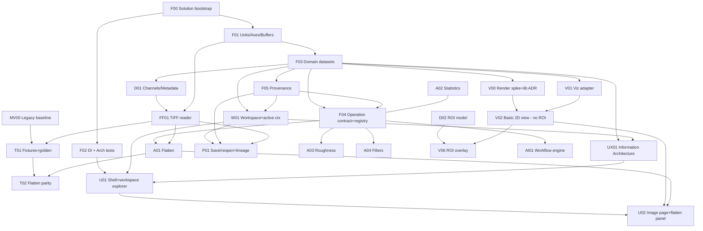

# Dependency Roadmap & Implementation Order

How to sequence the backlog (doc 31) so foundations exist before dependents, with the MVP as the
first vertical slice. Task IDs reference doc 31. **The backlog is the status source of truth;**
this doc is the order/parallelism view.

## Guiding order (prerequisites + parallelism, not a forced single line)

```
F00 Repository / Solution bootstrap          (must be first — nothing exists without it)
→ F01 Units / Axes / Buffers  (checkpoints A/B/C)
→ F03 Domain dataset
→ D01 Channel / Metadata
→ F04 Operation contract   ┐ (F04 & F05 partially parallel after F03)
→ F05 Provenance           ┘
→ FF01 TIFF reader
→ W01 Workspace
→ V01 Visualization adapter
→ V02 Basic 2D image view (no ROI)
→ A01 Flatten
→ Flatten parity test (T02)
→ P01 Workspace save / reopen
→ U01 Shell
→ U02 Image analysis + Before/After

Runs in PARALLEL (not on the critical line above):
• F02 DI + Architecture tests — after F00; parallel with F01/F03 (need not precede F01)
• MV00 Legacy baseline extraction — after legacy access only; parallel with F00–F05
  (does NOT depend on the new domain), feeding T01 once FF01 exists
• UX01 Information Architecture — after F03/W01 concepts are stable; parallel with V00
• V00 Rendering spike + lib ADR — after F03; parallel with headless analysis work
```

### Why this order (violation consequences)
- Build **F01 before F00** → impossible; no solution/projects exist yet (the gap this revision fixes).
- Build any operation before **F04** → recreates the central-switch anti-pattern (H4).
- Build persistence before **F05** → no provenance → no reproducibility (the whole point, C3).
- Build any view before **V01** → concrete chart lib leaks upward (C1 returns).
- Build **A01 before MV00/T01** → no golden baseline to prove numeric parity against (feedback §6).
- Build **U01 before UX01** → the implementer re-creates the legacy tree/docking/dialog UX in a
  new library instead of the redesigned IA (feedback §8).

## Dependency graph


(Nodes shaded/blue = run in parallel with the critical line, not on it.)

## MVP scope (P0) — the first vertical slice

**Goal:** prove every architectural contract on the image+flatten path, end to end, headless-first.

Included: **F00, F01, F02, F03, F04, F05, D01, FF01, MV00, T01, W01, UX01, V00, V01, V02, A01, A02,
P01, U01, U02, DOC01.** (ROI editing is **out** of MVP — see §ROI decision.)

## MVP verification checkpoints

Do **not** treat the MVP as one big build. Ship and verify these four checkpoints in order.

### Checkpoint 1 — Headless Import
- **Tasks:** F00, F01, F03, D01, FF01.
- **Done-when:** a TIFF fixture loads into an immutable domain `AfmDataset`; Unit, Axis, Channel,
  Metadata are correct; **no UI involved**.
- **Fail-if:** any WPF/commercial reference in Domain/FileFormats (arch test); axis/unit mismatch
  vs the file header.

### Checkpoint 2 — Headless Numeric Parity
- **Tasks:** MV00, T01, F04, F05, A01, A02.
- **Done-when:** Flatten runs as a registered operation; **input dataset is provably unmutated**;
  a derived dataset + `ProvenanceStep` are produced; output matches the frozen legacy golden data
  within the stated tolerance.
- **Fail-if:** input mutated; missing provenance; parity outside tolerance without an ADR;
  operation requires a central switch to dispatch.

### Checkpoint 3 — Workspace & Persistence
- **Tasks:** W01, P01.
- **Done-when:** original + derived datasets register in a workspace; save→reopen restores
  **dataset identity and original→derived lineage**; a moved source file relinks by hash.
- **Fail-if:** file path used as identity; lineage lost on reopen; unknown schema version silently
  accepted.

### Checkpoint 4 — Visualization & UX
- **Tasks:** UX01, V00, V01, V02, U01, U02.
- **Done-when:** 2D image displays (WriteableBitmap + palette + zoom/pan) via the adapter;
  before/after comparison works; a single **active context** is unambiguous; the flatten parameter
  panel drives A01; error/progress/cancel states are visible.
- **Fail-if:** any SciChart/DevExpress dependency; UX re-creates the legacy dialog forest instead
  of the UX01 IA; active dataset resolved ambiguously (the legacy defect).

## ROI decision (resolves feedback §5 — V02/D02 MVP contradiction)
**Decision:** the MVP 2D viewer (V02) and MVP Flatten (A01) **exclude interactive ROI**. Flatten
operates on the **full image** in the MVP (the operation's `Region` parameter defaults to whole
image — doc 13/A01). ROI is deferred to **D02 (ROI domain model, P1)** + **V06 (ROI overlay &
interaction, P1)**.
**Rationale:** the legacy flatten *supports* a region but does not *require* one; a full-image
flatten is a complete, verifiable capability. This removes the MVP→non-MVP dependency (V02 no
longer depends on D02) without losing a core capability. Region-restricted flatten becomes a
clean follow-up once D02/V06 exist.

## Parallelization summary
- **F04 & F05**: both start after F03 and are **co-developed** ("partially parallel"). F04's
  `OperationResult` references F05's `ProvenanceStep` type, so F04 *finalizes* once the F05
  provenance types exist — the shared type surface is designed together (see OD-7, provenance
  types' layer placement). This is why the graph shows `F05 → F04`: a type dependency, not a
  strict "finish-all-of-F05-first" gate.
- **F02** (DI + arch tests): after F00; parallel with F01/F03 (not a prerequisite of F01).
- **MV00** (legacy baseline): parallel with F00–F05 (decoupled from the new domain).
- **UX01**: after Domain/Workspace concepts stabilize; parallel with **V00**.
- **V00** + headless analysis (A01 numeric) can proceed in parallel.
- Once **F04** is stable, operations `A02…A16` are independent parallel tasks.
- **UI (U01/U02)** starts only after Domain, Workspace, UX01, and Visualization seams are stable.
- **A01 numeric parity** is verifiable **before** any UI.

## Design uncertainty flags (validate during, resolve via ADR — never assume)
- V00 chart-lib pick (ScottPlot vs OxyPlot) — Candidate (doc 20).
- Workspace container format (doc 16 OPEN) — before P01.
- Buffer strategy (F01-C) — ADR before F01-C is "done".
- Native stitch strategy — ADR before A17.
