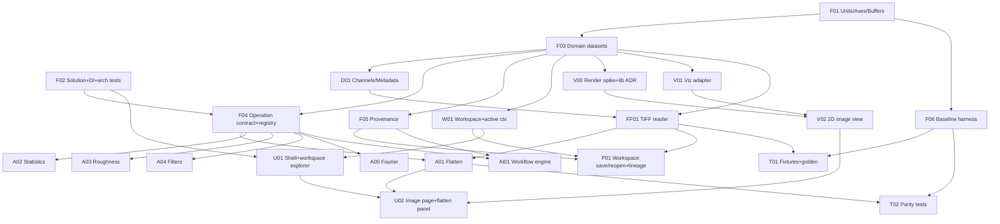

# Dependency Roadmap & Implementation Order

How to sequence the backlog (doc 31) so foundations exist before dependents, with the MVP as the
first vertical slice. Task IDs reference doc 31.

## Guiding order (the brief's example, instantiated)

```
Units/Axes/Buffers (F01)
→ Domain datasets (F03) + Channels/Metadata (D01)
→ Operation contract + registry (F04)  +  Provenance (F05)
→ TIFF reader (FF01)
→ Workspace + active context (W01)
→ Viz adapter + 2D image view (V01, V02)   [after V00 lib decision]
→ Flatten operation (A01)  +  Statistics (A02)
→ Workspace save/reopen with lineage (P01)
→ Image page + flatten panel + before/after (U01, U02)
→ Numeric parity harness/tests (F06, T01)
```

Violating this order breaks things predictably:
- Build any operation before **F04** → you recreate the central-switch anti-pattern.
- Build persistence before **F05** → provenance can't be recorded → no reproducibility (the whole point).
- Build any view before **V01** → the concrete chart lib leaks into upper layers (C1 returns).
- Build datasets before **F01** → units/axes get bolted on later inconsistently (legacy weakness).

## Dependency graph



## MVP scope (P0) — the first vertical slice

**Goal:** prove every architectural contract on the image+flatten path, end to end.

Included: **F01, F02, F03, F04, F05, F06, D01, FF01, W01, P01, V00, V01, V02, A01, A02, U01, U02,
T01, DOC01.**

MVP acceptance:
- Open a TIFF scan image → immutable domain dataset in a workspace.
- View it in 2D (WriteableBitmap + palette + ROI) via the adapter — **no SciChart/DevExpress**.
- Apply **Flatten** as a registered operation with typed params → derived dataset with provenance.
- See **before/after**.
- **Save the workspace, reopen it, and have the flatten lineage restored** (the legacy-impossible
  capability, doc 06).
- Flatten output matches the legacy `FW.Analysis.Calculate` baseline within tolerance (T01/F06).
- Architecture tests pass (Domain/Analysis reference no UI/viz/commercial types).

If the MVP holds, the design is validated and the rest fans out.

## Waves after MVP

- **Wave 2 (P1):** more image operations (A03–A07), content detection (FF05), curve view (V03),
  op parameter-panel framework (U03), provenance panel (U05), TIFF writer (FF02), parity tests (T02).
- **Wave 3 (P2):** spectroscopy/PiFM/profile ops (A08–A15), PS-PPT/HDF5 import (FF03/FF04),
  spectrum library (P02), 3D (V04), export (V05), curve/comparison UI (U04), schema migration (P03).
- **Wave 4 (P3):** stitch (A16/A17 + ADR), workflow engine + AI (AI01–AI03), ML (ML01/ML02).

## Parallelization
Once **F04 (operation contract)** is stable, operations `A03…A16` are **independent** tasks — the
core payoff of the contract. Viz backends (V03/V04) parallelize with operations. Persistence
(P01/P03) parallelizes with viz. Keep the foundations (F01–F06) strictly serial and reviewed.

## Design uncertainty flags (validate during, not after)
- V00 lib pick (ScottPlot vs OxyPlot) — spike required before V03.
- Workspace container format (doc 16 OPEN) — decide before P01.
- Buffer abstraction (pooled vs plain) — decide in F01.
- Native stitch strategy — ADR before A17.
